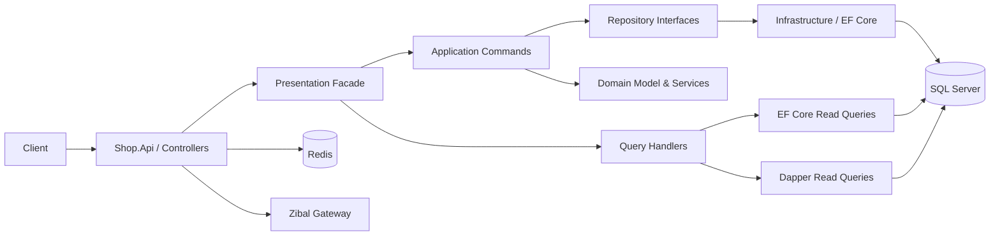

<div dir="rtl" align="right">

<div align="center">

# 🛒 EShop API

### بک‌اند ماژولار یک فروشگاه اینترنتی چندفروشندگی با ASP.NET Core 9

[English](README.md) · **فارسی**

<br/>

**زبان‌های پروژه**

[](https://learn.microsoft.com/dotnet/csharp/) [](https://developer.mozilla.org/docs/Web/JavaScript) [](#-docker)

**فناوری‌های اصلی**

[](https://dotnet.microsoft.com/) [](https://learn.microsoft.com/aspnet/core/) [](https://www.microsoft.com/sql-server) [](https://redis.io/) [](./LICENSE)

**برچسب‌های پروژه**

         

[](https://github.com/MohammadHasanp/Eshop-Api/stargazers) [](https://github.com/MohammadHasanp/Eshop-Api/forks) [](https://github.com/MohammadHasanp/Eshop-Api/commits/master) [](https://github.com/MohammadHasanp/Eshop-Api)

<p dir="rtl">
یک REST API برای مدیریت چرخه‌ی کامل یک فروشگاه اینترنتی؛ از کاربران، نقش‌ها، دسته‌بندی و محصول تا فروشندگان، موجودی، سبد/سفارش، ارسال، دیدگاه و پرداخت آنلاین.
</p>

[شروع سریع](#-شروع-سریع) · [معماری](#-معماری-پروژه) · [مستندات API](#-مستندات-api) · [ساختار پروژه](#-ساختار-solution) · [سازنده](#-سازنده)

</div>

> [!IMPORTANT]
> این مخزن در حال توسعه است. قبل از استفاده در محیط Production، بخش [نکات امنیتی و محدودیت‌های فعلی](#-نکات-امنیتی-و-محدودیتهای-فعلی) را حتماً مطالعه کنید.

## 📚 فهرست مطالب

- [معرفی](#-معرفی)
- [قابلیت‌ها](#-قابلیتها)
- [فناوری‌ها و زبان‌ها](#-فناوریها-و-زبانها)
- [معماری پروژه](#-معماری-پروژه)
- [ساختار Solution](#-ساختار-solution)
- [دامنه‌های کسب‌وکار](#-دامنههای-کسبوکار)
- [مستندات API](#-مستندات-api)
- [شروع سریع](#-شروع-سریع)
- [پیکربندی](#%EF%B8%8F-پیکربندی)
- [Migration و دیتابیس](#%EF%B8%8F-migration-و-دیتابیس)
- [احراز هویت](#-احراز-هویت)
- [Docker](#-docker)
- [نکات امنیتی و محدودیت‌ها](#-نکات-امنیتی-و-محدودیتهای-فعلی)
- [مشارکت](#-مشارکت)
- [سازنده](#-سازنده)
- [مجوز](#-مجوز)

## 🎯 معرفی

**EShop API** بک‌اند یک فروشگاه اینترنتی چندفروشندگی (Marketplace) است که با **ASP.NET Core Web API** و **.NET 9** توسعه داده شده است. ساختار پروژه از Clean Architecture الهام گرفته و از مفاهیم **Domain-Driven Design (DDD)**، جداسازی **Command/Query (CQRS)**، الگوی Repository، Domain Service، Value Object و Domain Event استفاده می‌کند.

در مسیر نوشتن داده‌ها، Commandها با **MediatR** به Handlerهای لایه Application هدایت می‌شوند و عملیات دامنه از طریق Repositoryهای مبتنی بر **Entity Framework Core** در SQL Server ذخیره می‌شود. در مسیر خواندن، Query Handlerها بسته به سناریو از EF Core یا **Dapper** استفاده می‌کنند. لایه Facade نیز رابط ساده و یکپارچه‌ای بین Controllerها و Command/Queryها ایجاد کرده است.

## ✨ قابلیت‌ها

- ثبت‌نام، ورود، خروج و تمدید توکن با **JWT + Refresh Token**
- ذخیره Hash توکن‌ها و اعتبارسنجی مجدد آن‌ها در سمت سرور
- مدیریت کاربران، پروفایل، تغییر رمز عبور و فعال/غیرفعال‌سازی حساب
- مدیریت آدرس‌های کاربر و انتخاب آدرس فعال
- مدیریت Role و Permission و زیرساخت کنترل دسترسی سفارشی
- دسته‌بندی چندسطحی محصولات
- مدیریت محصول، مشخصات فنی، تصویر اصلی و گالری تصاویر
- SEO Data برای دسته‌بندی و محصول
- مدیریت فروشندگان و موجودی هر فروشنده
- قیمت، تعداد و تخفیف در سطح موجودی فروشنده
- ثبت دیدگاه، ویرایش، حذف و تغییر وضعیت دیدگاه
- سبد خرید/سفارش، افزایش و کاهش تعداد آیتم‌ها و Checkout
- روش‌های ارسال و ثبت اطلاعات ارسال سفارش
- مدیریت Banner و Slider صفحه اصلی
- درگاه پرداخت **Zibal** و Callback تأیید تراکنش
- صفحه اصلی فروشگاه با داده‌های تجمیع‌شده
- فیلتر، صفحه‌بندی و DTOهای اختصاصی برای Queryها
- آپلود و نگهداری فایل‌ها در `wwwroot`
- پاسخ یکپارچه API و Middleware مدیریت Exception
- Swagger/OpenAPI، CORS، AutoMapper و FluentValidation
- زیرساخت Redis Distributed Cache
- Migrationهای آماده برای SQL Server

## 🧰 فناوری‌ها و زبان‌ها

### پشته فنی

| بخش | فناوری |
|---|---|
| Runtime / Framework | .NET 9, ASP.NET Core Web API |
| زبان اصلی | C# |
| پایگاه داده | Microsoft SQL Server |
| ORM | Entity Framework Core 9.0.10 |
| Micro ORM | Dapper 2.1.66 |
| Messaging / CQRS | MediatR 13.1.0 |
| Validation | Data Annotations, FluentValidation 12 |
| Authentication | JWT Bearer, Refresh Token |
| Authorization | Role/Permission-based custom filter |
| Cache | Redis Distributed Cache |
| Mapping | AutoMapper 15.1.0 |
| API Documentation | Swagger / OpenAPI (Swashbuckle) |
| Payment Gateway | Zibal |
| Serialization | System.Text.Json, Newtonsoft.Json |
| Containerization | Dockerfile (Windows Nano Server) |

### ترکیب زبان‌های مخزن

آمار زیر بر اساس داده‌های GitHub Linguist در زمان نگارش این مستند است و با تغییر کد ممکن است تغییر کند:

| زبان | سهم تقریبی | کاربرد در پروژه |
|---|---:|---|
| **C#** | 99.4% | Domain، Application، Infrastructure، Query و Web API |
| **JavaScript** | 0.3% | اعتبارسنجی سمت کاربر برای فایل‌ها |
| **Dockerfile** | 0.3% | Build و اجرای Container |

### Topicهای GitHub

`aspnet-core` · `csharp` · `dotnet` · `dotnet-9` · `web-api` · `rest-api` · `ecommerce` · `marketplace` · `clean-architecture` · `domain-driven-design` · `cqrs` · `mediatr` · `entity-framework-core` · `dapper` · `sql-server` · `jwt-authentication` · `redis` · `swagger` · `docker` · `zibal`

## 🏗 معماری پروژه

پروژه یک **Modular Monolith** لایه‌ای و الهام‌گرفته از Clean Architecture است. جریان معمول یک درخواست به شکل زیر است:



### الگوها و تصمیم‌های معماری

- **DDD:** موجودیت‌ها، Aggregate Rootها، Value Objectها، Domain Serviceها و Domain Eventها در لایه Domain قرار دارند.
- **CQRS:** Commandها در `Shop.Application` و Queryها در `Shop.Query` از هم جدا شده‌اند.
- **Mediator:** ارسال Command/Query و انتشار Eventها با MediatR انجام می‌شود.
- **Repository:** قرارداد Repositoryها در Domain و پیاده‌سازی آن‌ها در Infrastructure است.
- **Facade:** Controller مستقیماً با جزئیات Handlerها درگیر نمی‌شود و از Facade استفاده می‌کند.
- **Hybrid Data Access:** عملیات نوشتن عمدتاً با EF Core و بعضی خواندن‌های بهینه با Dapper انجام می‌شوند.
- **Dependency Injection:** ثبت وابستگی‌ها در `shop.Config`، `InfrastructureBootstrapper` و `FacadeBootstrapper` متمرکز شده است.
- **Unified Result:** خروجی Commandها با `OperationResult` و خروجی HTTP با `ApiResult` استاندارد شده است.

## 🗂 ساختار Solution

Solution شامل **۱۴ پروژه** است:

```text
Eshop-Api/
├── Common/
│   ├── Common.Domain/
│   ├── Common.Application/
│   ├── Query/
│   ├── Common.AspNetCore/
│   ├── Common.ChachHelper/
│   └── Common.Infrastructure/
├── Shop/
│   ├── Shop.Domain/
│   ├── Shop.Contract/
│   ├── Shop.Application/
│   ├── Shop.Infrastructure/
│   ├── Shop.Query/
│   ├── Shop.Presentation.Facade/
│   ├── shop.Config/
│   └── Shop.Api/
└── Eshop.sln
```

| پروژه | مسئولیت |
|---|---|
| `Common.Domain` | کلاس‌های پایه Domain، `BaseEntity`، `AggregateRoot`، Value Object، Exception و قرارداد Repository |
| `Common.Application` | قرارداد Command/Handler، `OperationResult`، Validation، File/Image/Security utility و ابزارهای مشترک |
| `Common.Query` | قرارداد Query/Handler، DTO پایه، Filter و Pagination |
| `Common.AspNetCore` | `ApiController`، ساختار `ApiResult`، Middleware خطا و ابزارهای ASP.NET Core |
| `Common.CacheHelper` | Extensionهای کار با Distributed Cache؛ مسیر فعلی پروژه `Common/Common.ChachHelper` است |
| `Common.Infrastructure` | محل زیرساخت مشترک؛ در وضعیت فعلی حداقل پیاده‌سازی را دارد و `net8.0` را هدف می‌گیرد |
| `Shop.Domain` | مدل دامنه فروشگاه، Aggregateها، Domain Serviceها، Eventها و Repository contractها |
| `Shop.Contract` | قراردادهای میانی ماژول Shop و وابستگی به Domain |
| `Shop.Application` | Use Caseهای نوشتن؛ Commandها، Handlerها و Event Handlerها |
| `Shop.Infrastructure` | `ShopContext`، EF Configuration، Repositoryها، Migrationها و `DapperContext` |
| `Shop.Query` | Use Caseهای خواندن، فیلترها، DTOها، Mapperها و Query Handlerهای EF/Dapper |
| `Shop.Presentation.Facade` | Facadeهای هر Aggregate و نقطه اتصال Controller به Command/Query |
| `shop.Config` | Composition Root و ثبت Dependencyها، MediatR، Domain Serviceها و File Service |
| `Shop.Api` | Controllerها، ViewModelها، JWT، Permission، Swagger، CORS، Zibal و فایل‌های استاتیک |

## 🧩 دامنه‌های کسب‌وکار

| دامنه | موجودیت‌ها / امکانات اصلی |
|---|---|
| هویت و کاربران | User، UserToken، UserRole، UserAddress، Wallet، ثبت‌نام و ورود |
| نقش و دسترسی | Role، RolePermission و Permissionهای مدیریتی/فروشندگی |
| کاتالوگ | Category چندسطحی، Product، ProductImage، ProductSpecification و SEO |
| فروشندگان | Seller، وضعیت فروشنده و SellerInventory |
| سفارش | Order، OrderItem، OrderAddress، وضعیت سفارش، Checkout و Finalize |
| ارسال | ShippingMethod و هزینه ارسال |
| دیدگاه | Comment و وضعیت انتشار دیدگاه |
| محتوای سایت | Banner، Slider و داده صفحه اصلی |
| پرداخت | ایجاد و Verify تراکنش از طریق Zibal |

## 📡 مستندات API

پس از اجرای پروژه، Swagger UI در آدرس زیر در دسترس است:

```text
http://localhost:5000/swagger
```

تمام Controllerها از Route پایه زیر استفاده می‌کنند:

```text
/api/[controller]
```

### گروه Endpointها

| Controller | Route پایه | کاربرد |
|---|---|---|
| `AuthController` | `/api/Auth` | Register، Login، Logout و RefreshToken |
| `UserController` | `/api/User` | کاربران، پروفایل جاری، رمز عبور، نقش و وضعیت حساب |
| `UserAddressController` | `/api/UserAddress` | CRUD آدرس‌ها و فعال‌سازی آدرس |
| `RoleController` | `/api/Role` | CRUD نقش‌ها و Permissionها |
| `CategoryController` | `/api/Category` | دسته‌بندی‌ها، فرزندان و CRUD |
| `ProductController` | `/api/Product` | فیلتر محصول، جزئیات، CRUD و تصاویر |
| `SellerController` | `/api/Seller` | فروشنده، پنل جاری و موجودی‌ها |
| `CommentController` | `/api/Comment` | فیلتر، دیدگاه محصول، CRUD و تغییر وضعیت |
| `OrderController` | `/api/Order` | سبد جاری، آیتم‌ها، Checkout و فیلتر سفارش |
| `ShippingMethodController` | `/api/ShippingMethod` | روش‌های ارسال |
| `BannerController` | `/api/Banner` | بنرها و موقعیت نمایش |
| `SliderController` | `/api/Slider` | اسلایدرها |
| `ShopController` | `/api/Shop` | داده تجمیعی صفحه اصلی |
| `TransactionController` | `/api/Transaction` | شروع پرداخت و Callback تأیید Zibal |

> Swagger مرجع اصلی Contract، پارامترها، مدل ورودی و کد وضعیت هر Endpoint است.

### قالب استاندارد پاسخ

```json
{
  "isSuccess": true,
  "data": {},
  "metaData": {
    "message": "عملیات با موفقیت انجام شد",
    "appStatusCode": 1
  }
}
```

مقادیر `appStatusCode` در وضعیت فعلی:

| مقدار | وضعیت |
|---:|---|
| `1` | Success |
| `2` | NotFound |
| `3` | BadRequest |
| `4` | LogicError |
| `5` | UnAuthorize |
| `6` | ServerError |

## 🚀 شروع سریع

### پیش‌نیازها

- [.NET SDK 9](https://dotnet.microsoft.com/download/dotnet/9.0)
- SQL Server 2019+ یا SQL Server 2022
- Redis (برنامه در وضعیت فعلی به `localhost:6379` متصل می‌شود)
- Git
- ابزار `dotnet-ef` نسخه 9 برای اجرای Migrationها
- Docker به‌صورت اختیاری، فقط برای بالا آوردن SQL Server و Redis

### ۱. دریافت سورس

```bash
git clone https://github.com/MohammadHasanp/Eshop-Api.git
cd Eshop-Api
```

### ۲. اجرای سرویس‌های زیرساختی

اگر SQL Server و Redis را از قبل نصب کرده‌اید، از این مرحله عبور کنید. برای اجرای سریع با Docker:

```bash
# Redis
docker run --name eshop-redis -p 6379:6379 -d redis:7-alpine

# SQL Server
export SQL_PASSWORD='Replace-With-A-Strong-Password!123'
docker run --name eshop-sql \
  -e 'ACCEPT_EULA=Y' \
  -e "MSSQL_SA_PASSWORD=${SQL_PASSWORD}" \
  -p 1433:1433 \
  -d mcr.microsoft.com/mssql/server:2022-latest
```

### ۳. ثبت تنظیمات محرمانه Development

پروژه `Shop.Api` دارای `UserSecretsId` است. به‌جای قرار دادن اطلاعات حساس در Git، از User Secrets استفاده کنید:

```bash
dotnet user-secrets set "ConnectionStrings:DefaultConnection" \
  "Server=localhost,1433;Database=EShop_Db;User Id=sa;Password=${SQL_PASSWORD};Encrypt=False;TrustServerCertificate=True;MultipleActiveResultSets=True;" \
  --project Shop/Shop.Api

dotnet user-secrets set "JwtConfig:SignInKey" \
  "Replace-With-A-Long-Random-Secret-Key-At-Least-32-Characters" \
  --project Shop/Shop.Api

dotnet user-secrets set "JwtConfig:Issuer" "Eshop.com" --project Shop/Shop.Api
dotnet user-secrets set "JwtConfig:Audience" "Eshop-api" --project Shop/Shop.Api
```

در PowerShell می‌توانید Connection String را مستقیماً جایگزین کنید یا ابتدا مقدار `$env:SQL_PASSWORD` را تنظیم کنید.

### ۴. Restore و Build

```bash
dotnet restore Eshop.sln
dotnet build Eshop.sln
```

### ۵. نصب EF CLI و ساخت دیتابیس

```bash
dotnet tool install --global dotnet-ef --version 9.0.10

dotnet ef database update \
  --project Shop/Shop.Infrastructure \
  --startup-project Shop/Shop.Api
```

اگر `dotnet-ef` از قبل نصب است، در صورت نیاز از دستور زیر استفاده کنید:

```bash
dotnet tool update --global dotnet-ef --version 9.0.10
```

### ۶. اجرای API

```bash
dotnet run --project Shop/Shop.Api -- --urls http://localhost:5000
```

سپس این آدرس‌ها را باز کنید:

- Swagger: <http://localhost:5000/swagger>
- API base URL: <http://localhost:5000/api>

## ⚙️ پیکربندی

تنظیمات اصلی در `Shop/Shop.Api/appsettings.json` قرار دارند، اما اطلاعات حساس باید با User Secrets در Development و Environment Variable/Secret Manager در Production جایگزین شوند.

| کلید | متغیر محیطی معادل | توضیح |
|---|---|---|
| `ConnectionStrings:DefaultConnection` | `ConnectionStrings__DefaultConnection` | اتصال SQL Server |
| `JwtConfig:SignInKey` | `JwtConfig__SignInKey` | کلید امضای JWT؛ طولانی و تصادفی باشد |
| `JwtConfig:Issuer` | `JwtConfig__Issuer` | صادرکننده توکن |
| `JwtConfig:Audience` | `JwtConfig__Audience` | مخاطب توکن |
| `ASPNETCORE_ENVIRONMENT` | `ASPNETCORE_ENVIRONMENT` | محیط اجرا؛ مانند Development یا Production |

> اتصال Redis در حال حاضر در `Shop/Shop.Api/Program.cs` با مقدار `localhost:6379` ثبت شده است. برای استقرار واقعی بهتر است آن را به Configuration منتقل کنید.

## 🗄️ Migration و دیتابیس

Migrationها در مسیر زیر نگهداری می‌شوند:

```text
Shop/Shop.Infrastructure/Migrations
```

### ایجاد Migration جدید

```bash
dotnet ef migrations add YourMigrationName \
  --project Shop/Shop.Infrastructure \
  --startup-project Shop/Shop.Api \
  --output-dir Migrations
```

### اعمال Migrationها

```bash
dotnet ef database update \
  --project Shop/Shop.Infrastructure \
  --startup-project Shop/Shop.Api
```

### حذف آخرین Migration اعمال‌نشده

```bash
dotnet ef migrations remove \
  --project Shop/Shop.Infrastructure \
  --startup-project Shop/Shop.Api
```

جداول در چند Schema منطقی از جمله `user`، `product`، `seller` و `order` سازمان‌دهی شده‌اند. `ShopContext` به‌صورت پیش‌فرض از `NoTracking` برای Queryها استفاده می‌کند و Domain Eventهای Aggregateها را هنگام `SaveChangesAsync` منتشر می‌کند.

## 🔐 احراز هویت

### ثبت‌نام

```bash
curl -X POST http://localhost:5000/api/Auth/Register \
  -H "Content-Type: application/json" \
  -d '{
    "phoneNumber": "09120000000",
    "password": "StrongPassword123!",
    "confirmPassword": "StrongPassword123!"
  }'
```

### ورود

```bash
curl -X POST http://localhost:5000/api/Auth/Login \
  -H "Content-Type: application/json" \
  -d '{
    "phoneNumber": "09120000000",
    "password": "StrongPassword123!"
  }'
```

پاسخ موفق Login شامل `token` و `refreshToken` است. برای Endpointهای محافظت‌شده، JWT را ارسال کنید:

```bash
curl http://localhost:5000/api/User/Current \
  -H "Authorization: Bearer YOUR_JWT_TOKEN"
```

### تمدید توکن

```bash
curl -X POST \
  "http://localhost:5000/api/Auth/RefreshToken?refreshToken=YOUR_REFRESH_TOKEN"
```

توکن‌های JWT و Refresh Token به‌صورت Hash در دیتابیس ذخیره می‌شوند. `CustomJwtValidation` علاوه بر اعتبار امضا و زمان، وجود توکن و فعال بودن حساب کاربر را نیز بررسی می‌کند.

## 🐳 Docker

Dockerfile پروژه در مسیر `Shop/Shop.Api/Dockerfile` قرار دارد و Build Context آن باید ریشه مخزن باشد:

```bash
docker build -f Shop/Shop.Api/Dockerfile -t eshop-api .
```

> [!WARNING]
> Dockerfile فعلی بر پایه imageهای **.NET 8 Windows Nano Server** نوشته شده، درحالی‌که پروژه‌های فعال Solution عمدتاً `net9.0` را هدف می‌گیرند. بنابراین پیش از Build باید imageهای SDK/Runtime را با نسخه هدف پروژه هماهنگ کنید. همچنین برای اجرای Linux Container لازم است imageهای Nano Server با imageهای Linux مناسب جایگزین شوند. در حال حاضر فایل `docker-compose` در مخزن وجود ندارد.

پورت‌های تعریف‌شده در Dockerfile:

- HTTP: `8080`
- HTTPS: `8081`

## ⚠️ نکات امنیتی و محدودیت‌های فعلی

برای استفاده جدی یا Production این موارد را در نظر بگیرید:

1. **Secretهای منتشرشده را معتبر فرض نکنید.** Connection String و JWT Key موجود در فایل‌های تنظیمات باید فوراً Rotate و با User Secrets، Environment Variables یا Secret Manager جایگزین شوند.
2. **Authorization همه‌جا یکدست فعال نیست.** تعدادی از Attributeهای `[Authorize]` و `PermissionChecker` در Controllerها کامنت شده‌اند یا فقط روی بعضی Actionها قرار دارند. پیش از Production، ماتریس دسترسی تمام Endpointها را بازبینی کنید.
3. **CORS در حال حاضر باز است.** Policy پروژه `AllowAnyOrigin/Method/Header` دارد و باید به Originهای مورد اعتماد محدود شود.
4. **Swagger در همه محیط‌ها فعال است.** در Production دسترسی آن را محدود یا غیرفعال کنید.
5. **Redis قابل پیکربندی نیست.** آدرس Redis در `Program.cs` ثابت است و بهتر است به `appsettings` منتقل شود.
6. **Dockerfile با Target Framework هماهنگ نیست.** توضیحات بخش Docker را ببینید.
7. **Test و CI وجود ندارد.** در نسخه فعلی پروژه Test Project و Workflow خودکار GitHub Actions دیده نمی‌شود؛ افزودن Unit، Integration و Architecture Test توصیه می‌شود.
8. مقادیر نمونه Azure AD در تنظیمات وجود دارند، اما جریان اصلی احراز هویت فعلی پروژه JWT سفارشی است.

## 🤝 مشارکت

برای مشارکت:

1. مخزن را Fork کنید.
2. یک Branch توصیفی بسازید: `feature/product-search` یا `fix/refresh-token`.
3. تغییرات را با کد خوانا و در صورت امکان Test مناسب انجام دهید.
4. مطمئن شوید Solution Build می‌شود.
5. Commit واضح بنویسید و Pull Request باز کنید.

پیشنهاد می‌شود در Pull Request توضیح دهید:

- چه مسئله‌ای حل شده است؛
- چه لایه‌ها یا Endpointهایی تغییر کرده‌اند؛
- روش تست تغییرات چیست؛
- آیا Migration یا تغییر Configuration لازم است یا خیر.

## 👨‍💻 سازنده

این پروژه توسط **Mohammad Hasan Pirayandeh** ساخته شده است:

- GitHub: [@MohammadHasanp](https://github.com/MohammadHasanp)
- Repository: [MohammadHasanp/Eshop-Api](https://github.com/MohammadHasanp/Eshop-Api)

اگر پروژه برایتان مفید بود، می‌توانید با دادن ⭐ از آن حمایت کنید.

## 📄 مجوز

این پروژه تحت مجوز متن‌باز **MIT** منتشر شده است. این مجوز اجازه استفاده، کپی، تغییر، ادغام، انتشار و توزیع پروژه را با حفظ متن Copyright و مجوز می‌دهد. نرم‌افزار بدون هرگونه ضمانت ارائه می‌شود.

برای مطالعه متن کامل، فایل [LICENSE](./LICENSE) را ببینید.

---

<div align="center">

ساخته‌شده با ❤️ و .NET

</div>

</div>
