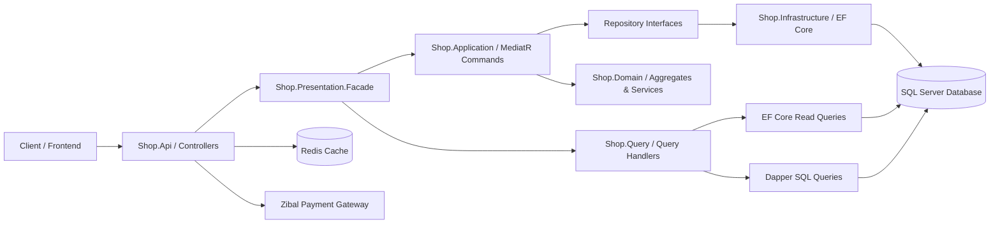

<div align="center">

# 🛒 EShop API

### Modular Multi-Vendor E-Commerce Web API with ASP.NET Core 9

**English** · [فارسی](README.fa.md)

<br/>

**Languages**

[](https://learn.microsoft.com/dotnet/csharp/) [](https://developer.mozilla.org/docs/Web/JavaScript) [](#-docker)

**Core Technologies**

[](https://dotnet.microsoft.com/) [](https://learn.microsoft.com/aspnet/core/) [](https://www.microsoft.com/sql-server) [](https://redis.io/) [](./LICENSE)

**Repository Topics**

         

[](https://github.com/MohammadHasanp/Eshop-Api/stargazers) [](https://github.com/MohammadHasanp/Eshop-Api/forks) [](https://github.com/MohammadHasanp/Eshop-Api/commits/master) [](https://github.com/MohammadHasanp/Eshop-Api)

<p>
A comprehensive modular REST API for end-to-end multi-vendor e-commerce management — from authentication, role-based access control, hierarchical categories, and product specifications to multi-vendor inventory, shopping cart, order checkout, shipping methods, comments, and online payment gateway integration.
</p>

[Quick Start](#-quick-start) · [Architecture](#-architecture) · [API Documentation](#-api-documentation) · [Solution Structure](#-solution-structure) · [Author](#-author)

</div>

> [!IMPORTANT]
> This repository is actively under development. Before deploying to production, please review the [Security Notes & Current Limitations](#-security-notes--current-limitations) section.

---

## 📚 Table of Contents

- [Overview](#-overview)
- [Key Features](#-key-features)
- [Tech Stack & Languages](#-tech-stack--languages)
- [Architecture](#-architecture)
- [Solution Structure](#-solution-structure)
- [Business Domains](#-business-domains)
- [API Documentation](#-api-documentation)
- [Quick Start](#-quick-start)
- [Configuration](#%EF%B8%8F-configuration)
- [Database & Migrations](#%EF%B8%8F-database--migrations)
- [Authentication & Security](#-authentication--security)
- [Docker](#-docker)
- [Security Notes & Current Limitations](#-security-notes--current-limitations)
- [Contributing](#-contributing)
- [Author](#-author)
- [License](#-license)

---

## 🎯 Overview

**EShop API** is a robust, modular backend for multi-vendor e-commerce (Marketplace) platforms built with **ASP.NET Core Web API** and **.NET 9**. 

The architecture draws heavily from **Clean Architecture** and incorporates core **Domain-Driven Design (DDD)** concepts, **Command Query Responsibility Segregation (CQRS)**, the Repository Pattern, Domain Services, Value Objects, and Domain Events.

- **Write Path (Commands):** Mutations flow through **MediatR** command handlers into rich domain aggregates, validated via FluentValidation, and persisted to SQL Server using **Entity Framework Core**.
- **Read Path (Queries):** Optimized read queries bypass heavy aggregate mappings and query the database directly using **EF Core** (with `AsNoTracking`) or high-performance **Dapper** micro-ORM queries.
- **Facade Layer:** A presentation facade decouples API controllers from application command/query handler details, providing a clean, unified API surface.

---

## ✨ Key Features

- **Authentication & Authorization:** Secure registration, login, logout, and token refresh using **JWT + Refresh Tokens** stored as salted hashes with server-side validation.
- **User & Profile Management:** User profile updates, password changes, active status toggles, and user address management.
- **Roles & Permissions:** Dynamic role creation and permission assignment with fine-grained endpoint protection.
- **Multi-Level Catalog:** Hierarchical category trees (main, sub, secondary categories) with dedicated SEO metadata.
- **Product & Inventory:** Products with technical specifications, image galleries, slug generation, and multi-vendor inventory management.
- **Multi-Vendor Marketplace:** Independent seller onboarding, store status management, and vendor-specific inventory pricing and discounts.
- **Cart & Orders:** Dynamic cart operations, item increment/decrement, checkout flows, order status tracking, and order finalization.
- **Shipping Methods:** Configurable shipping carriers, costs, and customer delivery address associations.
- **Product Reviews & Comments:** User comment submissions, administrative moderation, and review status workflows.
- **Home & Marketing Content:** Dynamic banners, carousels/sliders, and aggregated storefront payloads.
- **Payment Gateway Integration:** Payment lifecycle handling with the **Zibal** payment gateway and transaction callback verification.
- **Caching:** Distributed caching integration with **Redis**.
- **API Utilities:** Standardized response wrapper (`ApiResult`), global exception middleware, FluentValidation pipeline behaviors, and Swagger/OpenAPI documentation.

---

## 🧰 Tech Stack & Languages

### Core Technology Stack

| Layer / Concern | Technology |
|---|---|
| **Runtime / Framework** | .NET 9.0, ASP.NET Core Web API |
| **Language** | C# 13 |
| **Relational Database** | Microsoft SQL Server (2019 / 2022) |
| **ORM** | Entity Framework Core 9.0.10 |
| **Micro-ORM** | Dapper 2.1.66 |
| **Messaging & CQRS** | MediatR 13.1.0 |
| **Validation** | FluentValidation 12.0.0, Data Annotations |
| **Authentication** | JWT Bearer, Refresh Token |
| **Authorization** | Custom Role & Permission Filter (`PermissionCheckerAttribute`) |
| **Caching** | Redis Distributed Cache |
| **Object Mapping** | AutoMapper 15.1.0 |
| **API Documentation** | Swagger / OpenAPI (Swashbuckle 9.0.4) |
| **Payment Gateway** | Zibal Gateway SDK |
| **HTML Sanitization** | Ganss.HtmlSanitizer 9.0.886 |
| **Containerization** | Dockerfile |

### Language Breakdown

Statistics based on GitHub Linguist analysis:

| Language | Percentage | Primary Usage |
|---|---:|---|
| **C#** | 99.4% | Domain, Application, Infrastructure, Query, Facade, and API Layers |
| **JavaScript** | 0.3% | Client-side file validation scripts |
| **Dockerfile** | 0.3% | Multi-stage container build and deployment definitions |

---

## 🏗 Architecture

The repository follows a **Modular Monolith** structure inspired by Clean Architecture and DDD principles.



### Key Architectural Patterns

- **Domain-Driven Design (DDD):** Core business logic resides exclusively within Domain Entities, Aggregates, Value Objects, and Domain Services.
- **CQRS:** Strict segregation of Write models (`Shop.Application`) and Read models (`Shop.Query`).
- **Mediator Pattern:** `MediatR` handles command dispatching, validation pipeline execution, and domain event notifications.
- **Repository Pattern:** Domain defines interfaces; Infrastructure provides EF Core-backed implementations.
- **Facade Pattern:** Controllers interact with aggregate facades instead of binding directly to individual handlers.
- **Hybrid Persistence:** EF Core provides robust Unit of Work and change tracking for writes; Dapper provides fast, direct SQL execution for heavy reads.
- **Standardized Response Envelope:** All endpoints return a unified `ApiResult<T>` structure with predictable status codes.

---

## 🗂 Solution Structure

The solution contains **14 specialized projects** grouped into `Common` and `Shop` modules:

```text
Eshop-Api/
├── Common/
│   ├── Common.Domain/               # Base entity, aggregate root, value objects, exceptions
│   ├── Common.Application/            # Command/Handler abstractions, OperationResult, validation, file utilities
│   ├── Query/                         # Base query abstractions, filter models, pagination DTOs
│   ├── Common.AspNetCore/             # Base ApiController, ApiResult envelope, exception middleware
│   ├── Common.ChachHelper/            # Redis distributed cache extensions and helpers
│   └── Common.Infrastructure/         # Shared infrastructure building blocks (.NET 8 target)
├── Shop/
│   ├── Shop.Domain/                   # Core business logic, aggregates (User, Product, Order, etc.)
│   ├── Shop.Contract/                 # Inter-module contracts and domain references
│   ├── Shop.Application/              # CQRS Commands, command handlers, domain event handlers
│   ├── Shop.Infrastructure/           # ShopContext, EF configurations, repositories, migrations, DapperContext
│   ├── Shop.Query/                    # CQRS Queries, DTOs, mappers, EF & Dapper read handlers
│   ├── Shop.Presentation.Facade/      # Aggregate facades simplifying controller interaction
│   ├── shop.Config/                   # Dependency injection bootstrapping and composition root
│   └── Shop.Api/                      # ASP.NET Core Web API host, controllers, middleware, Swagger
└── Eshop.sln
```

---

## 🧩 Business Domains

| Domain | Core Entities & Aggregates | Key Responsibilities |
|---|---|---|
| **Identity & Users** | `User`, `UserToken`, `UserRole`, `UserAddress`, `Wallet` | Registration, login, token refresh, password management, profile management, addresses |
| **Access Control** | `Role`, `RolePermission`, `Permission` | Role assignment, granular permissions, administrative guards |
| **Catalog** | `Category`, `Product`, `ProductImage`, `ProductSpecification`, `SeoData` | Hierarchical categories, rich product specifications, image gallery, SEO metadata |
| **Marketplace & Sellers** | `Seller`, `SellerInventory`, `SellerStatus` | Vendor management, vendor approvals, inventory stock, vendor pricing and discounts |
| **Orders & Checkout** | `Order`, `OrderItem`, `OrderAddress`, `OrderStatus` | Cart operations, quantity updates, checkout workflow, order history and finalization |
| **Shipping** | `ShippingMethod` | Shipping provider configuration and freight costs |
| **Reviews & Feedback** | `Comment`, `CommentStatus` | User product reviews, moderation queue, status changes |
| **Storefront Content** | `Banner`, `Slider`, `HomeViewModel` | Homepage marketing banners, promotional carousels, aggregated storefront data |
| **Payments** | `Transaction`, `ZibalService` | Payment initiation, gateway redirection, and verification callback handling |

---

## 📡 API Documentation

Once running, the interactive **Swagger UI** is available at:

```text
http://localhost:5000/swagger
```

All controllers follow the standard route prefix:

```text
/api/[controller]
```

### Endpoint Summary

| Controller | Base Route | Description |
|---|---|---|
| `AuthController` | `/api/Auth` | Register, Login, Logout, and RefreshToken operations |
| `UserController` | `/api/User` | User management, current profile, password reset, roles, and status |
| `UserAddressController` | `/api/UserAddress` | User delivery address CRUD and active address selection |
| `RoleController` | `/api/Role` | Role creation, editing, deletion, and permission assignment |
| `CategoryController` | `/api/Category` | Multi-level category hierarchy and CRUD |
| `ProductController` | `/api/Product` | Product filtering, details, specifications, images, and CRUD |
| `SellerController` | `/api/Seller` | Vendor profile, inventory items, and stock management |
| `CommentController` | `/api/Comment` | Product reviews filtering, CRUD, and admin approval |
| `OrderController` | `/api/Order` | Shopping cart, item quantity updates, checkout, and order queries |
| `ShippingMethodController` | `/api/ShippingMethod` | Shipping carrier configurations |
| `BannerController` | `/api/Banner` | Marketing banner management and positioning |
| `SliderController` | `/api/Slider` | Homepage carousel slider management |
| `ShopController` | `/api/Shop` | Aggregated homepage data endpoint |
| `TransactionController` | `/api/Transaction` | Payment initiation and Zibal verification callback |

### Standard Response Structure

All endpoints return a uniform response envelope:

```json
{
  "isSuccess": true,
  "data": {},
  "metaData": {
    "message": "Operation completed successfully",
    "appStatusCode": 1
  }
}
```

#### Application Status Codes (`appStatusCode`):

| Code | Status | Description |
|---:|---|---|
| `1` | `Success` | The operation was successful |
| `2` | `NotFound` | The requested entity was not found |
| `3` | `BadRequest` | Validation failed or invalid payload |
| `4` | `LogicError` | Business rule violation |
| `5` | `UnAuthorize` | Authentication or permission failed |
| `6` | `ServerError` | Unhandled server error |

---

## 🚀 Quick Start

### Prerequisites

- [.NET SDK 9.0](https://dotnet.microsoft.com/download/dotnet/9.0)
- Microsoft SQL Server 2019+ or 2022 (Local or Docker)
- Redis Server (default listening on `localhost:6379`)
- Git
- `dotnet-ef` CLI tool (version `9.0.10`)
- Docker (optional, for quickly provisioning SQL Server and Redis)

---

### 1. Clone the Repository

```bash
git clone https://github.com/MohammadHasanp/Eshop-Api.git
cd Eshop-Api
```

---

### 2. Run Infrastructure (Docker)

If you already have SQL Server and Redis running locally, skip this step. Otherwise, start them using Docker:

```bash
# Start Redis
docker run --name eshop-redis -p 6379:6379 -d redis:7-alpine

# Start SQL Server
export SQL_PASSWORD='Replace-With-A-Strong-Password!123'
docker run --name eshop-sql \
  -e 'ACCEPT_EULA=Y' \
  -e "MSSQL_SA_PASSWORD=${SQL_PASSWORD}" \
  -p 1433:1433 \
  -d mcr.microsoft.com/mssql/server:2022-latest
```

---

### 3. Configure Development Secrets

The `Shop.Api` project is configured with a `UserSecretsId`. Store sensitive settings in .NET User Secrets instead of checking them into source control:

```bash
# Set SQL Server Connection String
dotnet user-secrets set "ConnectionStrings:DefaultConnection" \
  "Server=localhost,1433;Database=EShop_Db;User Id=sa;Password=${SQL_PASSWORD};Encrypt=False;TrustServerCertificate=True;MultipleActiveResultSets=True;" \
  --project Shop/Shop.Api

# Set JWT Security Keys
dotnet user-secrets set "JwtConfig:SignInKey" \
  "YourVeryLongSecretSigningKeyWithAtLeast32Characters" \
  --project Shop/Shop.Api

dotnet user-secrets set "JwtConfig:Issuer" "Eshop.com" --project Shop/Shop.Api
dotnet user-secrets set "JwtConfig:Audience" "Eshop-api" --project Shop/Shop.Api
```

---

### 4. Restore & Build

```bash
dotnet restore Eshop.sln
dotnet build Eshop.sln
```

---

### 5. Apply Database Migrations

Install or update the EF Core CLI tool:

```bash
dotnet tool install --global dotnet-ef --version 9.0.10
# If already installed:
dotnet tool update --global dotnet-ef --version 9.0.10
```

Apply pending migrations to your database:

```bash
dotnet ef database update \
  --project Shop/Shop.Infrastructure \
  --startup-project Shop/Shop.Api
```

---

### 6. Run the API

```bash
dotnet run --project Shop/Shop.Api -- --urls http://localhost:5000
```

Navigate to:
- **Swagger UI:** [http://localhost:5000/swagger](http://localhost:5000/swagger)
- **API Base:** [http://localhost:5000/api](http://localhost:5000/api)

---

## ⚙️ Configuration

Application settings are located in `Shop/Shop.Api/appsettings.json`. Sensitive values should always be overridden via User Secrets in development or Environment Variables in production.

| Key | Environment Variable | Description |
|---|---|---|
| `ConnectionStrings:DefaultConnection` | `ConnectionStrings__DefaultConnection` | SQL Server connection string |
| `JwtConfig:SignInKey` | `JwtConfig__SignInKey` | Secret key used to sign and verify JWT tokens (min 256-bit) |
| `JwtConfig:Issuer` | `JwtConfig__Issuer` | Token issuer identifier |
| `JwtConfig:Audience` | `JwtConfig__Audience` | Token audience identifier |
| `ASPNETCORE_ENVIRONMENT` | `ASPNETCORE_ENVIRONMENT` | Application environment (`Development`, `Staging`, `Production`) |

> 💡 **Note:** Redis connection is currently configured in `Shop/Shop.Api/Program.cs` pointing to `localhost:6379`. For production, it is recommended to bind it to `appsettings.json`.

---

## 🗄️ Database & Migrations

Migrations are maintained in:

```text
Shop/Shop.Infrastructure/Migrations
```

### Adding a New Migration

```bash
dotnet ef migrations add <MigrationName> \
  --project Shop/Shop.Infrastructure \
  --startup-project Shop/Shop.Api \
  --output-dir Migrations
```

### Applying Migrations

```bash
dotnet ef database update \
  --project Shop/Shop.Infrastructure \
  --startup-project Shop/Shop.Api
```

### Removing the Last Unapplied Migration

```bash
dotnet ef migrations remove \
  --project Shop/Shop.Infrastructure \
  --startup-project Shop/Shop.Api
```

Database tables are organized into domain-specific schemas including `user`, `product`, `seller`, and `order`. `ShopContext` defaults to `NoTracking` queries and automatically dispatches domain events upon `SaveChangesAsync`.

---

## 🔐 Authentication & Security

### 1. Register a User

```bash
curl -X POST http://localhost:5000/api/Auth/Register \
  -H "Content-Type: application/json" \
  -d '{
    "phoneNumber": "09120000000",
    "password": "StrongPassword123!",
    "confirmPassword": "StrongPassword123!"
  }'
```

### 2. Login

```bash
curl -X POST http://localhost:5000/api/Auth/Login \
  -H "Content-Type: application/json" \
  -d '{
    "phoneNumber": "09120000000",
    "password": "StrongPassword123!"
  }'
```

A successful response yields an access `token` and a `refreshToken`.

### 3. Calling Protected Endpoints

```bash
curl -X GET http://localhost:5000/api/User/Current \
  -H "Authorization: Bearer YOUR_ACCESS_TOKEN"
```

### 4. Refreshing the Token

```bash
curl -X POST \
  "http://localhost:5000/api/Auth/RefreshToken?refreshToken=YOUR_REFRESH_TOKEN"
```

The custom `CustomJwtValidation` middleware validates token expiration, signature integrity, token presence in the database, and account active status on each protected request.

---

## 🐳 Docker

The project includes a Dockerfile located at `Shop/Shop.Api/Dockerfile`. Build the image with the repository root as the build context:

```bash
docker build -f Shop/Shop.Api/Dockerfile -t eshop-api .
```

> [!WARNING]
> The current Dockerfile is configured for **.NET 8 Windows Nano Server**, while the solution's active projects target **.NET 9.0**. When deploying to Linux environments, update the base images to the official `.NET 9 Linux` runtime (`mcr.microsoft.com/dotnet/aspnet:9.0`) and SDK (`mcr.microsoft.com/dotnet/sdk:9.0`).

### Container Ports

- **HTTP:** `8080`
- **HTTPS:** `8081`

---

## ⚠️ Security Notes & Current Limitations

When evaluating this project for enterprise or production use, consider the following:

1. **Rotate Exposed Secrets:** Rotate any sample connection strings and JWT keys found in default configuration files. Always use secure secret managers.
2. **Review Authorization Attributes:** Some `[Authorize]` and `PermissionChecker` attributes in controllers may be commented or partially applied. Audit the permission matrix across all endpoints before production deployment.
3. **Restrict CORS:** The current CORS configuration permits `AllowAnyOrigin`, `AllowAnyMethod`, and `AllowAnyHeader`. Restrict this to trusted frontend origins in production.
4. **Environment-Gated Swagger:** Swagger is currently accessible in all environments; ensure it is gated behind `IsDevelopment()` in production.
5. **Configurable Redis Connection:** Extract hardcoded `localhost:6379` Redis configurations into configuration settings.
6. **Testing & CI/CD:** There are currently no dedicated unit or integration test projects. Adding xUnit/NUnit test suites and GitHub Actions CI workflows is recommended.

---

## 🤝 Contributing

Contributions, issues, and feature requests are welcome!

1. **Fork** the repository.
2. Create a feature branch: `git checkout -b feature/product-search` or `git checkout -b fix/auth-token`.
3. Commit your changes with clear messages: `git commit -m "feat: implement elastic product search"`.
4. Ensure the solution builds cleanly: `dotnet build Eshop.sln`.
5. **Push** to the branch: `git push origin feature/product-search`.
6. Open a **Pull Request** describing the problem solved, affected layers, and testing steps.

---

## 👨‍💻 Author

Developed by **Mohammad Hasan Pirayandeh**:

- GitHub: [@MohammadHasanp](https://github.com/MohammadHasanp)
- Repository: [MohammadHasanp/Eshop-Api](https://github.com/MohammadHasanp/Eshop-Api)

If you find this project helpful, please consider giving it a ⭐ on GitHub!

---

## 📄 License

This project is licensed under the terms of the **MIT License**. See the [LICENSE](./LICENSE) file for details.

---

<div align="center">

Built with ❤️ and .NET 9

</div>
